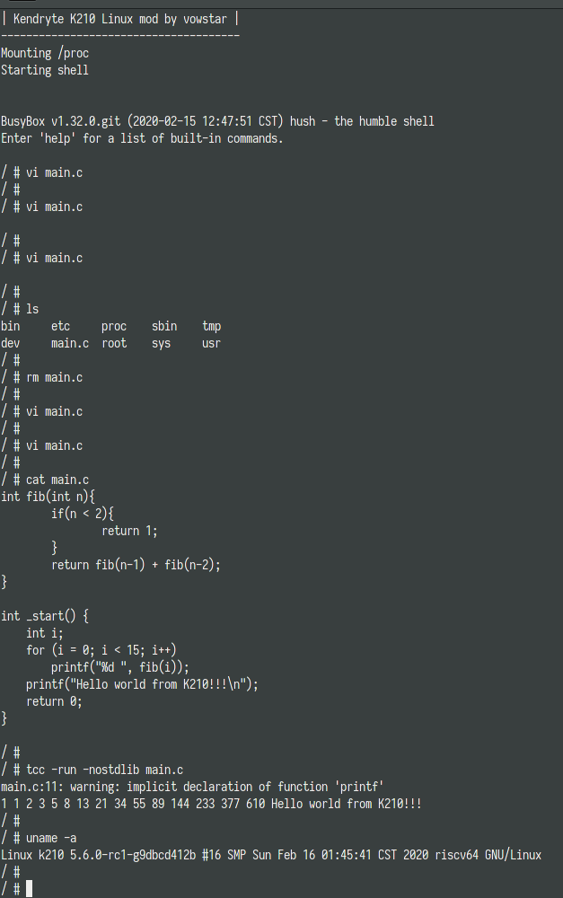

# k210-linux-nommu

## Introduction

This is a tutorial for beginners, mainly describes how to compile the kernel to run NOMMU linux on k210. And, this tutorial will show how to cross compile a tcc so that you can execute a C program with tcc on the k210. The kernel source is download from https://www.kernel.org, and applied [Damien Le Moal's k210 patch](https://lore.kernel.org/linux-riscv/BYAPR04MB5816C1EADCEF92F1F1DE60E0E7140@BYAPR04MB5816.namprd04.prod.outlook.com/T/#t) [@damien-lemoal](https://github.com/damien-lemoal)

## Before build

Before build, you should clone this project first and install the packages that buildroot depends on.

### Debian bullseye or Ubuntu 18.04.4

```bash
DEBIAN_FRONTEND=noninteractive apt-get update -qq && \
DEBIAN_FRONTEND=noninteractive apt-get install -yq \
    build-essential \
    device-tree-compiler \
    bison \
    flex \
    file \
    git \
    curl \
    wget \
    cpio \
    python \
    unzip \
    rsync \
    bc
```

### Fedora 31 or CentOS 8

```bash
RUN dnf -y update && \
    dnf -y groupinstall 'Development Tools' && \
    dnf -y --enablerepo=PowerTools install \
        autoconf \
        gperf \
        bison \
        flex \
        wget \
        curl \
        git \
        python36 \
        perl \
        sudo \
        cpio
```

### Git clone

```bash
git clone https://github.com/vowstar/k210-linux-nommu.git

cd k210-linux-nommu

export PROJ_ROOT=$(pwd)
```

## Buildroot

First we need to compile the toolchain, according to the description of Damien Le Moal's k210 patch, the toolchain can be obtained through [modified buildroot](https://github.com/damien-lemoal/riscv64-nommu-buildroot). Originally planned to be added as a git submodule, but some people said that this is a tutorial for beginners, so the [buildroot source code](./riscv64-nommu-buildroot) was added to this project.

Original buildroot by Damien Le Moal @damien-lemoal:

https://github.com/damien-lemoal/riscv64-nommu-buildroot

### Move kernel

Run ``sh ./prepare_buildroot.sh`` to put kernel archive into ``riscv64-nommu-buildroot/package/kernel`` to prevent file not found error.

```bash
cd $PROJ_ROOT
sh ./prepare_buildroot.sh
```

### Build toolchain

Before build kernel, we should build riscv64 nommu uClibc toolchain first.

This process needs to ensure a good network connection. A lot of software is downloaded when compiling.

```bash
cd "$PROJ_ROOT/riscv64-nommu-buildroot"
make riscv64_nommu_defconfig
make
```

### Install toolchain

```bash
cd "$PROJ_ROOT/riscv64-nommu-buildroot"
sudo cp -r output/host /opt/riscv64-uclibc
export PATH=/opt/riscv64-uclibc/bin:$PATH
```

## Build Rootfs

### Busybox

This busybox clone from git://git.busybox.net/busybox.git. Originally planned to be added as a git submodule, but some people said that this is a tutorial for beginners, so the [busybox source code](./busybox) was added to this project.

I modified the ``$PROJ_ROOT/busybox/configs/k210_nommu_defconfig`` file to fit k210 nommu linux.

```bash
export PATH=/opt/riscv64-uclibc/bin:$PATH
cd "$PROJ_ROOT/busybox"
make k210_nommu_defconfig
make SKIP_STRIP=y
make SKIP_STRIP=y install
```

After install, all the data installed to ``$PROJ_ROOT/rootfs_k210``

### Tiny C Compiler

C Scripting Everywhere - The Smallest ANSI C compiler. We have a wish is to have a C compiler on k210 that can develop k210 C programs. 
So we cross-compiled tcc. This process is done by [@minux](https://github.com/minux) and me together.

The Tiny C Compiler source code from https://github.com/mirror/tinycc.git. Originally planned to be added as a git submodule, but some people said that this is a tutorial for beginners, so the [tinycc source code](./tinycc) was added to this project.

```bash
export PATH=/opt/riscv64-uclibc/bin:$PATH
cd "$PROJ_ROOT/tinycc"
./configure --prefix=/usr --cross-prefix=riscv64-linux- --cpu=riscv64 --extra-cflags="-DCONFIG_TCC_STATIC=1" --extra-ldflags=-Wl,-elf2flt=-r
make
make DESTDIR=../rootfs_k210 install
```

If not add ``--extra-cflags="-DCONFIG_TCC_STATIC=1"``, when compile it will get error:

```
tcc.h:41:12: fatal error: dlfcn.h: No such file or directory
```

[@minux](https://github.com/minux) fix it using ``-DCONFIG_TCC_STATIC=1``

Also the current k210 nommu uclibc have no threading support, so I changed the code and removed the ``-lpthread``:

```diff
--- a/Makefile
+++ b/Makefile
@@ -30,7 +30,8 @@ ifdef CONFIG_WIN32
  CFGWIN = -win
  NATIVE_TARGET = $(ARCH)-win$(if $(findstring arm,$(ARCH)),ce,32)
 else
- LIBS=-lm -lpthread
+ #LIBS=-lm -lpthread
+ LIBS=-lm
  ifneq ($(CONFIG_ldl),no)
   LIBS+=-ldl
  endif
```

When tcc is compiled, it consumes a lot of memory, which makes it impossible to run on k210 nommu linux. [@minux](https://github.com/minux) found the reason in only 10 minutes, and edit the code as follows:

```diff
--- a/tccpp.c
+++ b/tccpp.c
@@ -130,9 +130,9 @@ ST_FUNC void expect(const char *msg)
 #define TAL_DEBUG_FILE_LEN 40
 #endif
 
-#define TOKSYM_TAL_SIZE     (768 * 1024) /* allocator for tiny TokenSym in table_ident */
-#define TOKSTR_TAL_SIZE     (768 * 1024) /* allocator for tiny TokenString instances */
-#define CSTR_TAL_SIZE       (256 * 1024) /* allocator for tiny CString instances */
+#define TOKSYM_TAL_SIZE     (64 * 1024) /* allocator for tiny TokenSym in table_ident */
+#define TOKSTR_TAL_SIZE     (64 * 1024) /* allocator for tiny TokenString instances */
+#define CSTR_TAL_SIZE       (16 * 1024) /* allocator for tiny CString instances */
 #define TOKSYM_TAL_LIMIT    256 /* prefer unique limits to distinguish allocators debug msgs */
 #define TOKSTR_TAL_LIMIT    128 /* 32 * sizeof(int) */
 #define CSTR_TAL_LIMIT      1024
```

And then it is works.

Then, we encountered the mprotect problem when ``tcc -run``. [@minux](https://github.com/minux) found the reason, k210 nommu linux don't need mprotect. Edit the code:

```diff
diff --git a/tccrun.c b/tccrun.c
index 4bf709d..42a0852 100644
--- a/tccrun.c
+++ b/tccrun.c
@@ -304,6 +304,13 @@ static int tcc_relocate_ex(TCCState *s1, void *ptr, addr_t ptr_diff)
 
 static void set_pages_executable(TCCState *s1, void *ptr, unsigned long length)
 {
+#if defined TCC_TARGET_RISCV64
+    /* RISC-V NON MMU don't need mprotect */
+    void __clear_cache(void *beginning, void *end);
+    __clear_cache(ptr, (char *)ptr + length);
+    return;
+#endif
+
 #ifdef _WIN32
     unsigned long old_protect;
     VirtualProtect(ptr, length, PAGE_EXECUTE_READWRITE, &old_protect);
```

It almost works.

TODO: Add elf2flt support. The tcc output format is elf, can't run under k210 nommu linux directly, so need some convert.

But ``tcc -run`` works, example:

```c
// main.c
int fib(int n){
    if(n < 2){
        return 1;
    }
    return fib(n-1) + fib(n-2);
}

int _start() {
    int i;
    for (i = 0; i < 15; i++)
        printf("%d ", fib(i));
    printf("Hello world from K210!!!\n");
    return 0;
}
```

Run with:

```bash
tcc -run -nostdlib main.c
```

The result:



### k210 cpio image

Run ``sh ./prepare_k210_cpio.sh`` to put k210 rootfs cpio image into ``linux-kernel/k210.cpio`` to update images.

```bash
cd $PROJ_ROOT
sh ./prepare_k210_cpio.sh
```

## Build Kernel

The [linux-5.6-rc1 source](https://www.kernel.org) applied [Damien Le Moal's k210 patch](https://lore.kernel.org/linux-riscv/BYAPR04MB5816C1EADCEF92F1F1DE60E0E7140@BYAPR04MB5816.namprd04.prod.outlook.com/T/#t). 

Thank you so much for their efforts, signed-off-by commiters:

- Damien Le Moal <damien.lemoal@wdc.com>
- Anup Patel <anup.patel@wdc.com>
- Christoph Hellwig <hch@lst.de>

Originally planned to be added as a git submodule, but some people said that this is a tutorial for beginners, so the [kernel source code](./linux-kernel) was added to this project. 

In order to be able to compile smoothly, I shamelessly put the ROOTFS ``k210.cpio`` binary file into the kernel source directory. This file should not be submitted to the source directory. This is a negative example, please do not do this like me.

```bash
cd "$PROJ_ROOT/linux-kernel"
export PATH=/opt/riscv64-uclibc/bin:$PATH
make ARCH=riscv CROSS_COMPILE=riscv64-linux- nommu_k210_defconfig
make ARCH=riscv CROSS_COMPILE=riscv64-linux- -j
```

## Play

Program the k210 board and enjoy linux. Suppose you are using Sipeed MAIX dan development board and the serial port is ``/dev/ttyUSB0``.

To use serial port whith user $(whoami), you need add $(whoami) into uucp or/and diaout group.

```bash
sudo usermod -a -G uucp $(whoami)
sudo usermod -a -G diaout $(whoami)
sudo python3 -m pip install kflash
su $(whoami)

kflash -B dan -b 3000000 -p /dev/ttyUSB0 arch/riscv/boot/loader.bin
python3 -m serial.tools.miniterm --raw --filter colorize /dev/ttyUSB0 115200
```

Using vi editor to add a file ``main.c``

```c
#include <stdio.h>

int fib(int n){
    if(n < 2){
        return 1;
    }
    return fib(n-1) + fib(n-2);
}

int main(int argc, char* argv[]) {
    int i;
    for (i = 0; i < 15; i++)
        printf("%d ", fib(i));
    printf("Hello world from K210!!!\n");
    return 0;
}
```

And run with ``tcc -run main.c``

```
tcc -run main.c
1 1 2 3 5 8 13 21 34 55 89 144 233 377 610 Hello world from K210!!!
```

You will get the hello world output.

Enjoy!
